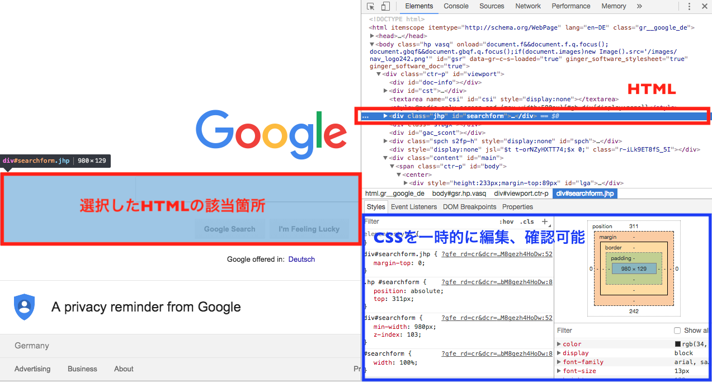
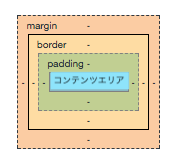

```
ステータス: 公開
タイプ: 学習教材
```

# 初めてのCSS

## 目的

- CSSファイルの作成方法を知る。
- CSSの基本を理解する。
- 簡単なCSSを定義できるようになる。

## CSSとは？

CSS(Cascading Style Sheet)は、スタイルシート言語と言われるもので、HTMLやXMLで記述された文章の見た目や見栄えを整え、表現するために用いられます。
CSSは要素（element）を、ウェブやメディアの画面上でどのように表現されるべきかを定義することができます。現在広く使用されているバージョンはCSS3で、W3C標準仕様というものが定められています。W3Cは、CSSを書く上でのガイドラインのようなもので、なるべくW3Cの定める基準に沿った書き方を心がけることが推奨されています。

mozilaが提供するリソース、MDNもW3Cと同じくらいオフィシャルなガイドラインです。
CSSでわからないこと、書き方の見本をチェックした時はW3C、MDNで検索、確認すると正しい書き方をチェックすることができます。

## CSSの書き方

### CSSファイルの作成方法と参照方法

CSSのファイルはHTMLと同じ種類の「テキストファイル」と呼ばれるものです。
保存するファイルの拡張子は、HTMLは`.html`ですが、CSSは`.css`になります。

適用させるHTMLファイルと同じサーバー上に保存することで、HTMLファイルをブラウザで参照するとCSSが適用されていることが確認できます。

パソコン内（ローカル環境）にファイルを作成している場合は、HTMLファイルとCSSファイルを１つのフォルダに入れて、HTMLファイルをブラウザーのアイコンにドラッグ&ドロップすると参照できます。

### CSSの適用の仕方

CSSの適用の仕方には、 以下の3つの方法があります。

1. headタグ内に読み込む方法
2. HTMLタグ内のstyle属性として読み込む方法
3. 外部ファイルとして読み込む方法

基本的には`3の外部ファイルとして読み込む方法`が推奨されていますので、ここではその方法を解説します。

※ CSSファイルを外部ファイルとして`.css`の拡張子のファイルで作成することが前提となります。

CSSを適用する`.html`拡張子のファイルの`<head>`タグ内に、CSSファイルを `styles.css`とした場合、以下のように書きます。

```html
<head>
  <!-- 〜省略〜 -->
  <link rel="stylesheet" href="styles.css">
</head>
```

こうすることで、外部ファイルとしてCSSが適用されます。CSSが反映されないのは、大抵の場合外部ファイルとして読み込んでいないことが多いので、読み込まれない場合には、まずCSSファイルが読み込まれているか確認をしましょう。またCSSファイルが異なるフォルダにある場合は相対パスを使って`href="../styles.scss"`のように指定します。

## セレクタ、プロパティ、値

CSSにも構造はあって、HTMLとは少し異なる書き方をします。

```css
h2 {
  color: red;
}
```

まず、CSSの書き方の構造を解説していきます。上記の例で`h2`の要素を指定している箇所が、**セレクタ**です。「スタイルの種類」である、`color`を**プロパティ**、プロパティに実行してほしい具体的な内容を**値**と言います。

プロパティと値は、`{}`で囲っておく必要があります。
つまり先ほどの上記の記述例は以下のような構成ということです。

```css
セレクタ {
  プロパティ: 値;
}
```

もう少し詳細な書き方の説明になりますが、プロパティの隣には`:`、値の隣には`;`を書き加えるのを忘れないようにしましょう。
また、CSSは一つのセレクタに対して、複数のプロパティを設定することができます。

```css
h2 {
  color: red;
  font-size: 20px;
}

h3 {
  color: white;
  background-color: gray;
}
```

その場合は上記のように書いていきます。

### コメント、コメントアウト

HTMLのように、CSSもコメントを書くことができます。
例を見てみましょう。

```css
/* これはコメントです */

h2 {
  color: red; /* 文字色の表示（こんな風にメモも残せます） */
  font-size: 20px; /* 文字の大きさの表示 */
}
```

コメントは、`/* */`と囲まれた部分がコメントとして認識され、実際のコードには影響しません。
ブラウザで表示させた時にも、コメント箇所は無視されるので、自分用のメモ、もしくは複数のチームで作業をする場合にメモを残すために使われています。
ただし、サイトを右クリックして、「ページのソースを表示」（developer toolと言います）を行うと、ソースコードと一緒にコメントも表示されます。

パスワードなど個人情報は書かないようにしましょう。

複数行に渡ってコメントを書きたい場合は、以下のように書きます。

```css
/*
これも
CSSの
コメントです
*/
```

## セレクタ：class属性指定

先ほどのCSSの書き方の基本では以下のようになっていました。

```css
h2 {
  color: red; /* 文字色の表示（赤色に指定） */
}
```

ただ、これではHTMLファイルにある全ての`h2`要素全てに対して、文字の色を赤くする表示の指定が適応されてしまいます。
特定の箇所だけ文字の色を赤から別の色にしたいという場合にはどうするのでしょうか？

特定の箇所に適応させたい表現指定がある場合は、HTMLのclass属性を利用して指定していきます。

先に書き方を提示すると以下のような構造になります。

```css
h2 .yellow-font{
  color: yellow;
  font-size: 20px;
}
```

`.yellow-font` というものが追加されていますね。
 この`h2`の隣に新しく書き加えられた`.yellow-font`がHTMLのclass属性で表現を指定しています。

 HTMLも合わせて見ていくと理解が深まります。

 ```html
 <h2>赤色のH2</h2>
 <h2 class="yellow-font">黄色のH2</h2>
 ```

 ```css
 /* 全てのh2の文字色を赤に指定 */
 h2 {
  color: red;
  font-size: 20px;
 }

 /* このh2だけは文字色を黄色に指定 */
 h2.yellow-font {
  color: yellow;
  font-size: 20px;
 }
 ```

 HTMLで2つ目の`h2`のみclassを指定して、文字の色をここだけ黄色に変えようとしています。
 したがって、`.yellow-font`classを指定して属性を利用することで、指定した`h2`のみ表現の指定を変えることができます。

h2要素の中でも、特定のclass属性を持ったh2要素のみをセレクタとしたということです。

CSSのclass属性の指定では、必ず`.`をclass名の前につけて書くようにしましょう。

class属性の書き方には、`h2`要素限定でなく、どんな要素でも`class="yellow-font"`属性を持った全ての要素の表現を指定することができます。

例として`class="yellow-font"`要素をもつ、`p`と`h1`も文字色を黄色にしたい場合がそれに当たります。

```html
<h1 class="yellow-font">黄色のH1</h1>
<h2>赤色のH2</h2>
<p class="yellow-font">黄色のp</p>
```

```css
/* h2はclass="yellow-font"の属性ではないので赤色で表示される */
h2 {
  color: red;
  font-size: 20px;
}

/* class="yellow-font"の属性を持つ要素は、全て文字色を黄色に指定 */
.yellow-font{
  color: yellow;
  font-size: 20px;
}
```

書き方をおさらいすると以下のようになります。

```css
.class名 {
  プロパティ: 値;
}
```

## セレクタ：id属性指定

id属性も基本的にはclass属性と同じですが、書き方だけ少し違います。class属性が`".class名"`となるのに対し、id属性は`"#id名"`となります。

## セレクタ：子孫セレクタ

子孫セレクタを使用すると、HTMLの構成に基づいた指定をすることで、より詳細なCSSの指定をすることができます。
先ほどの例では、単純なHTMLの構造を用いていましたが、以下のようなHTMLの構成に、子孫セレクタは有効です。

```html
<h1>このH1タグは文字色を変えない</h1>
<div>
  <article>
    <h1>このh1タグ要素のみ文字色を黄色にする</h1>
  </article>
</div>
```

先ほどのclass属性の例にあったHTMLよりも構成が増えています。
 `div > article > h1` という構成です。
 `div > article > h1` の構成の一番最後にある `h1` のみ文字色を黄色にしたいので子孫セレクタで指定して、文字色を変えてみます。

```css
div article h1 {
  color: yellow;
}
```

HTMLの構成に沿うことことで `div > article > h1` の `h1` タグの箇所のみ、文字色を黄色にすることができます。

## セレクタ：擬似クラス

擬似要素では、リンクやボタン要素にカーソルを合わせると色が変わるといった、それぞれの「状態」によってスタイルを変えることができます。

リンクテキストにカーソルを合わせると色が変化する擬似クラスを例にしてみます。
リンクテキストの要素である、 `<a>` タグ要素は維持しますが、「カーソルが合わさった」状態(ホバーといいます)と、「カーソルを外す/カーソルを合わせる前」状態とで `<a>` タグのスタイルを変化させる必要があります。

```css
a { /* カーソルを外す/カーソルを合わせる前 */
  color: #0404ff;
}
a:hover { /* カーソルが合わさった状況 */
  color: #fccd05;
}
```

表示は以下のようになります。

ホバー前:


ホバー時:


[サンプルコード](./samples/pseudo_class)


## プロパティ

プロパティはたくさんあるので、ここではよく使用する代表的なものを簡単にまとめておきます。
そのほかメジャーでないプロパティはMDNなどのリファレンスを調べてみるのが良い方法です。

| テキスト、フォント関係 | 指定の種類 |
| ------------- | -----:|
| color     | 文字色の指定 |
| font-size | 文字サイズの指定 |
| font-weight | 文字の太さの指定 |
| text-align | 行の左寄せ、中央寄せ、右寄せ指定 |
| font-family | 文字の種類を指定 |
| font-style | 文字をイタリックや斜体に指定 |


## Developer Toolsでのデバッグの仕方

HTML、CSSに限らず、実装した機能やスタイルがきちんと反映されているか、思い通りに反映されていない場合は、どこにどんな原因があるのかを把握して、正しく修正する必要があります。

Google ChromeとFirefoxには `Developer Tools` というデバッグ機能があり、検証することが簡単にできます。

ここではGoogle ChromeのDeveloper Toolsを使用します。

Developer Toolsの使い方は簡単です。

1. ページのどこでもいいので右クリック
2. 「検証（inspect）」をクリック


これでDeveloper Toolsが使えるようになりました。

開いているページのHTMLのコード、CSSのコードが閲覧できるようになっているはずです。
HTMLの要素をどれでも選択すると、その要素に全て該当するCSSの指定が表示されます。
ここで自由にCSSの指定を変えたり、消したりして検証（debug）することができます。



Webページを開発する際には、developer toolでまずはCSSの指定、スタイルを試しながら編集すると、思うような表示に近づけることができ、どこで何がエラーとして発生しているのかも検証でき、確実な修正ができます。

## ボックスレイアウト（ボックスモデル）

HTML要素（ `<div>` `<span>` `<article>` 要素など）には、それぞれ四角い領域＝ボックスとして存在しています。

この四角い領域は、１つのHTML要素に対して以下の４つに区分することができます。



 **コンテンツエリア**は、`width`（横幅）と`height`（縦幅）のプロパティと値で調整します。
 そのほかの領域、例えば各要素の余白部分に当たる`margin`や`padding`も、値やプロパティを指定することで調整、表示を指定することが可能です。

先ほど紹介した、developer toolを使って色々なウェブサイトのボックスレイアウトを変更して、感覚をつかんでみましょう。
developer toolで変更した内容は、一時的に検証、デバッグするだけなので、ページをリロードすると全てリセットされます。

そのほかボックスモデルの詳細（Flexbox、Float）は、Class3、Class4で詳しく学びます。
今はボックスモデルの構造と、該当するそれぞれのプロパティと値をdeveloper toolで色々なWebページのCSSの指定を編集して、感覚をつかんでいきましょう。

### ボックスモデル関連のプロパティ

ボックスモデルの感覚を掴むためには、やはり手を動かすことですが、実際の例を元に理解を深めてから手を動かす方がより理解につながります。

ここでは、ボックスモデルの感覚を効率よく掴むために、`margin`と`padding`の使用例を元に理解を深めていきましょう。

`margin`と`padding`は、ボックス関連のプロパティで、最もよく使用するプロパティです。

具体的にそれぞれどういったプロパティかというと、`margin`は外側の余白、`padding`は内側の余白です。

上記の四角い領域の図をもう一度確認してみるとよくわかります。


内側の緑が `padding` 、外側のオレンジが `margin` となっていますね。
余白が `margin` と `padding` と別れているのには理由があり、それぞれ適したレイアウト方法に使用することで、より思い通りのボックスレイアウトが実現できるようになります。

| プロパティ | 適した使用方法 |
| ------------- | -----:|
| margin | 要素の位置調整 |
| padding（widthとheightも組み合わせる） | 要素自体の大きさ調整 |

具体的な例を見てみましょう。

```html
<div class="box-model">
  div要素
</div>
```

```css
.box-model {
  margin: 50px;
  padding: 50px;
  background-color: navy;
  border: 10px solid yellow;
  color: white
}
```

上記のコードは、実際には以下の画像のように表示されます。


developer toolも合わせて見ていくとわかりやすくなるので、一緒に見ていきましょう。
該当するHTMLの箇所をdeveloper toolで選択すると、以下の画像のように `margin` や `padding` 、コンテンツエリアなどが画面左のブラウザで実際にコードが反映されている箇所にも色がつきます。


画像右端、developer toolで表示されているボックスモデルの図も見てみましょう。
同じように色分けが `margin`、`padding` などにしてあるのが確認できます。

上記のCSSコードと全く同じスタイルも表示されているので、ここでもう少しdeveloper toolを使って`margin`と`padding`を変えてみます。

要素の位置の調整では、`margin`プロパティを使うと良いと先ほど学んだので、developer toolのCSSで`margin`プロパティの値を変えて、div要素全体を下に少し移動させてみましょう。


developer tool画面のCSS `margin` の値箇所をダブルクリックして、 `500px 50px 50px 50px` と書き換えてみます。

実は `margin` も `padding` も、上下左右の値を個別に指定することができます。
`margin-top: 500px;` と書くと `margin` の上部分の値を指定することもできますが、コードはなるべく短くコンパクトに書くことを心がけたいので、 `margin: 上 右 下 左` と、時計回りで一行に書いてまとめる方法がスッキリして見えます。

さらに言うと、CSSをdeveloper toolで書き換える前に表示されていた、 `margin: 50px;` という書き方は、上下左右全てが均等に50pxという省略した書き方ということです。

よって、 `margin: 500px 50px 50px 50px;` という書き方で `margin` の上部分だけを50pxから500pxに増やしたので、div要素全体の位置が下に移動させることができた、ということです。

今度は `padding` でどうなるか試してみます。
元の配置から `padding` だけを変えてみます。


developer tool画面のCSS `padding` の値箇所をダブルクリックして、 `500px 50px 50px 50px` と書き換えます。

`padding: 500px 50px 50px 50px;` という書き方で `padding` の上部分だけを50pxから500pxに増やしたので、div要素の大きさが大きくなり、「div要素」と言うテキストコンテンツはそのままの位置、つまり、 `padding` 上部に押されて下に表示されるということです。

この「div要素」のテキストコンテンツを画面真ん中、コンテンツエリアの真ん中に配置させたい場合はどうするのでしょうか？

答えは簡単で、 `padding` の下部分の値を増やし、 `padding` 上部分の値を500pxから減らして調整すると、中央に配置できます。

`margin` `padding` 以外にもボックスモデルで使用するプロパティはあるので、以下に簡単にまとめておきます。

これ以外にもあるので、基本的にはMDNなど公式のドキュメントで確認する癖をつけておくと良いでしょう。

ここで使用した例のサンプルコードは以下からアクセスできるので、ダウンロードしてHTMLファイルをブラウザに読み込み、developer toolで色々とボックスレイアウトのプロパティと値を変更して、実際に手を動かしてインプットしましょう。

[boxmodel-example/index.html](./samples/boxmodel-example/index.html)

| ボックスモデル関係 | 指定の種類 |
| ------------- | -----:|
| margin | マージンの指定 |
| padding | パディングの指定 |
| width | 幅の指定 |
| height | 縦の指定 |
| clear | 要素回り込み解除の指定 |
| z-index | 要素の重なり方の順序指定 |
| position | ボックスの配置方法の指定 |
| background-color | 背景の指定 |
| background-image | 背景画像の指定 |
| background-repeat | 背景画像のリピートの仕方の指定 |
| border-width | ボーダーの太さ指定 |
| border-color | ボーダーの色指定 |
| border-style | ボーダーのスタイル指定 |
| border-bottom | ボーダー下（下線）のスタイルを指定 |

## CSSでスタイル、レイアウトする前に必要な設定（default値をリセット）

ここまできたらWebページをレイアウト、スタイルする準備がほぼ整いました。
しかし、その前にブラウザの特性について知って、それに伴った対処をしていく必要があります。

実は、ブラウザは初期設定＝defaultで自動的にmarginやpaddingといったプロパティに値を付け加えています。
私たちの把握していない`margin`や`padding`の値が勝手に存在するということなので、それをリセットせずにCSSでスタイルしていくと、なかなか思い通りのボックスモデルにならないことがよく起こります。

それを未然に防ぐために、一定の要素に対してはブラウザによるdefault値のリセットを先にCSSで設定しておきましょう。

ブラウザのdefault値をリセットするついでに、ページ全体で固定しておきたいことも設定しておきましょう。（例：文字色、文字のサイズ、フォントの種類、リンクテキストの色と擬似クラス、h1〜h6、p、imgなど）

```css
@charset "UTF-8";

/* bodyの設定 */
body {
  margin: 0;
  padding: 0;
  color: #414242; /* 全体の文字色も固定 */
  font-size: 14px; /* 全体の文字サイズも固定 */
  font-family: "ヒラギノ角ゴ ProN W3", "Hiragino Kaku Gothic ProN", sans-serif; /* フォントの種類も固定 */
}

/* リンクテキストの設定 */
a {
  color: #020d99;
}

a:visited {
  color: #5e5c5c; /* 訪問済みのリンクの色指定 */
}

a:hover {
  color: #020d99;
  font-weight: 500;
  text-decoration: none;
}

/* h1〜h6の設定 */
h1,h2,h3,h4,h5,h6 {
  margin-top: 0; /* h1〜h6にもdefault値がブラウザにより存在するためリセット */
}

/* p要素の設定 */
p {
  margin-top: 0;
  line-height: 1.0; /* 行間に適度な間を開けさせる */
}

/* 画像要素の設定 */
img {
  vertical-align: bottom; /* 余白（画像下）をリセットするため */
}
```

## チャレンジ

[チャレンジ2](./challenge/README.md)

## 更に学ぼう

### 記事で学ぶ

- [CSS - MDN](https://developer.mozilla.org/ja/docs/Learn/CSS)

### 動画で学ぶ

- [CSS入門 #1~#19 - ドットインストール](https://dotinstall.com/lessons/basic_css_v3)
