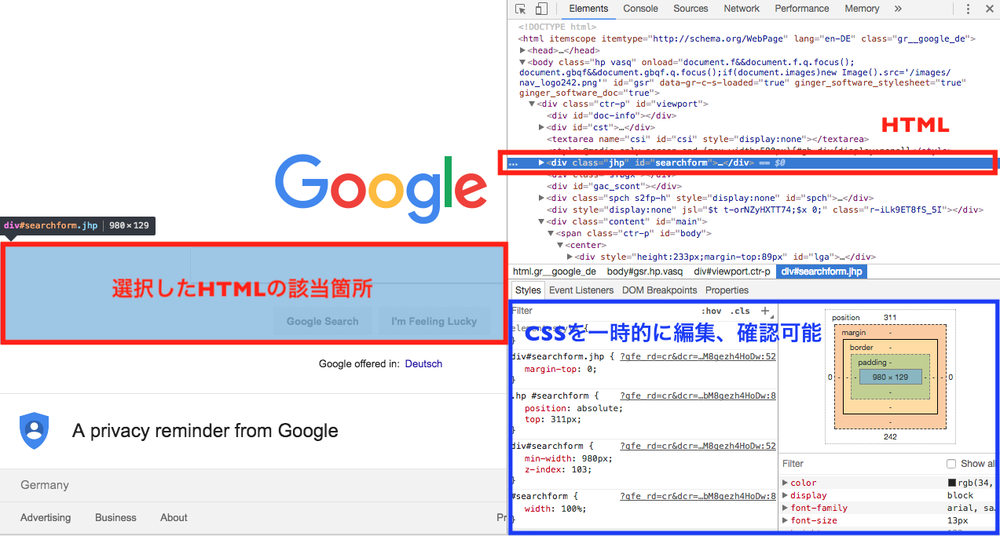
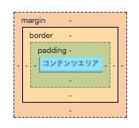
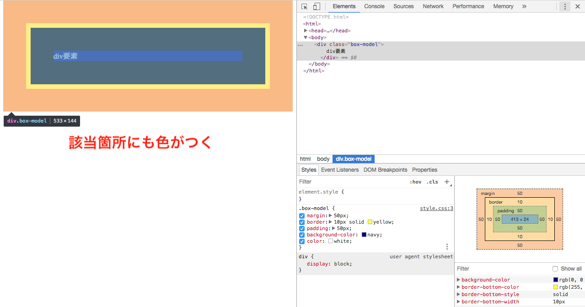
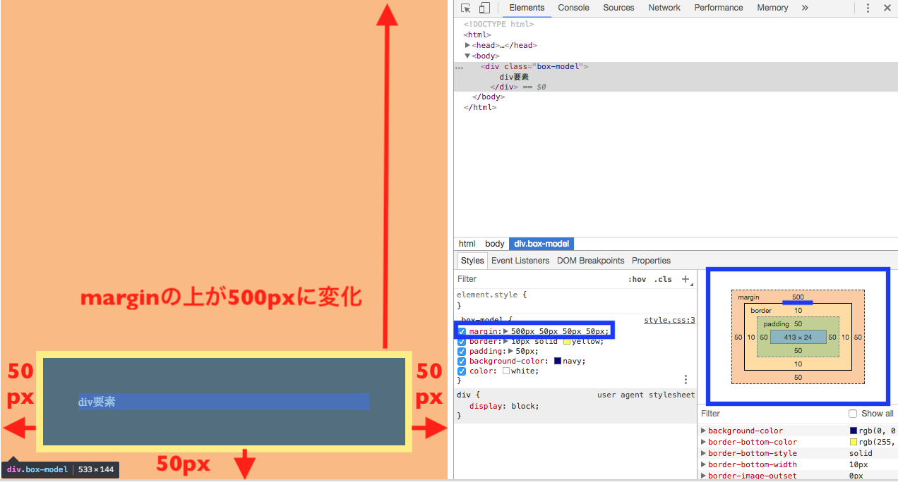
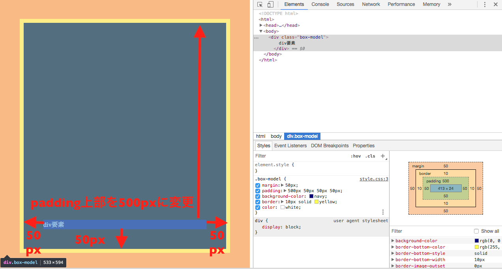

## プロパティ

プロパティはたくさんあるので、ここではよく使用する代表的なものを簡単にまとめておきます。
そのほかメジャーでないプロパティはMDNなどのリファレンスを調べてみるのが良い方法です。

| テキスト、フォント関係 | 指定の種類 |
| ------------- | -----:|
| color     | 文字色の指定 |
| font-size | 文字サイズの指定 |
| font-weight | 文字の太さの指定 |
| text-align | 行の左寄せ、中央寄せ、右寄せ指定 |
| font-family | 文字の種類を指定 |
| font-style | 文字をイタリックや斜体に指定 |

## Developer Toolsでのデバッグの仕方

HTML、CSSに限らず、実装した機能やスタイルがきちんと反映されているか、思い通りに反映されていない場合は、どこにどんな原因があるのかを把握して、正しく修正する必要があります。

Google ChromeとFirefoxには `Developer Tools` というデバッグ機能があり、検証することが簡単にできます。

ここではGoogle ChromeのDeveloper Toolsを使用します。

Developer Toolsの使い方は簡単です。

1. ページのどこでもいいので右クリック
2. 「検証（inspect）」をクリック

これでDeveloper Toolsが使えるようになりました。

開いているページのHTMLのコード、CSSのコードが閲覧できるようになっているはずです。
HTMLの要素をどれでも選択すると、その要素に全て該当するCSSの指定が表示されます。
ここで自由にCSSの指定を変えたり、消したりして検証（debug）することができます。



Webページを開発する際には、developer toolでまずはCSSの指定、スタイルを試しながら編集すると、思うような表示に近づけることができ、どこで何がエラーとして発生しているのかも検証でき、確実な修正ができます。

## ボックスレイアウト（ボックスモデル）

HTML要素（ `<div>` `<span>` `<article>` 要素など）には、それぞれ四角い領域＝ボックスとして存在しています。

この四角い領域は、１つのHTML要素に対して以下の４つに区分することができます。



*コンテンツエリア**は、`width`（横幅）と`height`（縦幅）のプロパティと値で調整します。
そのほかの領域、例えば各要素の余白部分に当たる`margin`や`padding`も、値やプロパティを指定することで調整、表示を指定するとが可能です。

先ほど紹介した、developer toolを使って色々なウェブサイトのボックスレイアウトを変更して、感覚をつかんでみましょう。
developer toolで変更した内容は、一時的に検証、デバッグするだけなので、ページをリロードすると全てリセットされます。

そのほかボックスモデルの詳細（Flexbox、Float）は、Class3、Class4で詳しく学びます。
今はボックスモデルの構造と、該当するそれぞれのプロパティと値をdeveloper toolで色々なWebページのCSSの指定を編集して、感覚をつかんでいきましょう。

### ボックスモデル関連のプロパティ

ボックスモデルの感覚を掴むためには、やはり手を動かすことですが、実際の例を元に理解を深めてから手を動かす方がより理解につながります。

ここでは、ボックスモデルの感覚を効率よく掴むために、`margin`と`padding`の使用例を元に理解を深めていきましょう。

`margin`と`padding`は、ボックス関連のプロパティで、最もよく使用するプロパティです。

具体的にそれぞれどういったプロパティかというと、`margin`は外側の余白、`padding`は内側の余白です。

上記の四角い領域の図をもう一度確認してみるとよくわかります。


内側の緑が `padding` 、外側のオレンジが `margin` となっていますね。
余白が `margin` と `padding` と別れているのには理由があり、それぞれ適したレイアウト方法に使用することで、より思い通りのボックスレイアウトが実現できるようになります。

| プロパティ | 適した使用方法 |
| ------------- | -----:|
| margin | 要素の位置調整 |
| padding（widthとheightも組み合わせる） | 要素自体の大きさ調整 |

具体的な例を見てみましょう。

```html
<div class="box-model">
  div要素
</div>
```

```css
.box-model {
  margin: 50px;
  padding: 50px;
  background-color: navy;
  border: 10px solid yellow;
  color: white
}
```

<iframe width="100%" height="300" src="//jsfiddle.net/codegrit_hiro/60f8umkr/4/embedded/html,css,result/dark/" allowfullscreen="allowfullscreen" allowpaymentrequest frameborder="0"></iframe>

developer toolも合わせて見ていくとわかりやすくなるので、一緒に見ていきましょう。
該当するHTMLの箇所をdeveloper toolで選択すると、以下の画像のように `margin` や `padding` 、コンテンツエリアなどが画面左のブラウザで実際にコードが反映されている箇所にも色がつきます。



画像右端、developer toolで表示されているボックスモデルの図も見てみましょう。
同じように色分けが `margin`、`padding` などにしてあるのが確認できます。

上記のCSSコードと全く同じスタイルも表示されているので、ここでもう少しdeveloper toolを使って`margin`と`padding`を変えてみます。

要素の位置の調整では、`margin`プロパティを使うと良いと先ほど学んだので、developer toolのCSSで`margin`プロパティの値を変えて、div要素全体を下に少し移動させてみましょう。



developer tool画面のCSS `margin` の値箇所をダブルクリックして、 `500px 50px 50px 50px` と書き換えてみます。

実は `margin` も `padding` も、上下左右の値を個別に指定することができます。
`margin-top: 500px;` と書くと `margin` の上部分の値を指定することもできますが、コードはなるべく短くコンパクトに書くことを心がけたいので、 `margin: 上 右 下 左` と、時計回りで一行に書いてまとめる方法がスッキリして見えます。

さらに言うと、CSSをdeveloper toolで書き換える前に表示されていた、 `margin: 50px;` という書き方は、上下左右全てが均等に50pxという省略した書き方ということです。

よって、 `margin: 500px 50px 50px 50px;` という書き方で `margin` の上部分だけを50pxから500pxに増やしたので、div要素全体の位置が下に移動させることができた、ということです。

今度は `padding` でどうなるか試してみます。
元の配置から `padding` だけを変えてみます。



developer tool画面のCSS `padding` の値箇所をダブルクリックして、 `500px 50px 50px 50px` と書き換えます。

`padding: 500px 50px 50px 50px;` という書き方で `padding` の上部分だけを50pxから500pxに増やしたので、div要素の大きさが大きくなり、「div要素」と言うテキストコンテンツはそのままの位置、つまり、 `padding` 上部に押されて下に表示されるということです。

この「div要素」のテキストコンテンツを画面真ん中、コンテンツエリアの真ん中に配置させたい場合はどうするのでしょうか？

答えは簡単で、 `padding` の下部分の値を増やし、 `padding` 上部分の値を500pxから減らして調整すると、中央に配置できます。

`margin` `padding` 以外にもボックスモデルで使用するプロパティはあるので、以下に簡単にまとめておきます。

これ以外にもあるので、基本的にはMDNなど公式のドキュメントで確認する癖をつけておくと良いでしょう。

ここで使用した例のサンプルコードは以下からアクセスできるので、ダウンロードしてHTMLファイルをブラウザに読み込み、developer toolで色々とボックスレイアウトのプロパティと値を変更して、実際に手を動かしてインプットしましょう。

[codegrit-html-css-lesson02-sample-boxmodel](https://github.com/codegrit-jp-students/codegrit-html-css-lesson02-sample-boxmodel)

| ボックスモデル関係 | 指定の種類 |
| ------------- | -----:|
| margin | マージンの指定 |
| padding | パディングの指定 |
| width | 幅の指定 |
| height | 縦の指定 |
| clear | 要素回り込み解除の指定 |
| z-index | 要素の重なり方の順序指定 |
| position | ボックスの配置方法の指定 |
| background-color | 背景の指定 |
| background-image | 背景画像の指定 |
| background-repeat | 背景画像のリピートの仕方の指定 |
| border-width | ボーダーの太さ指定 |
| border-color | ボーダーの色指定 |
| border-style | ボーダーのスタイル指定 |
| border-bottom | ボーダー下（下線）のスタイルを指定 |